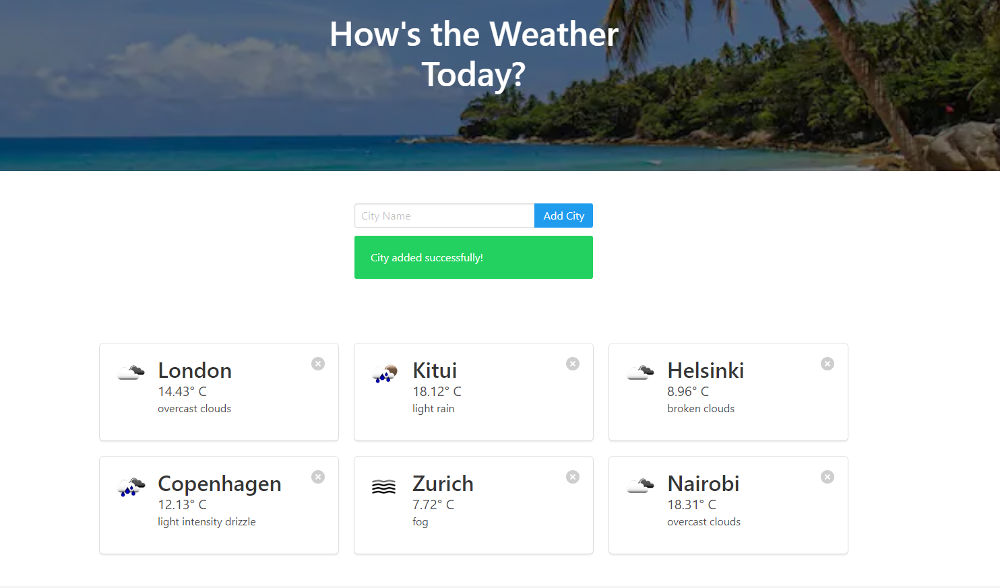

# Flask weatherApp
 A simple web app built using flask that displays the current weather of cities across the world. The application allows the user to enter a city and returns the current weather conditions of the entered city.

 The application is built with Python, Flask, SQLAlchemy, SQLite and HTML.

 # Screenshot
 

 # Installation and set up
 Clone this repo into your machine. 
 Prerequisites: **python, virtual environment**

 ### set up a virtual environment inside the repo and activate it
 python -m venv venv

 ### Install requirements
 pip install -r requirements.txt

 ### Run the application
 flask run

 ### Enjoy!

